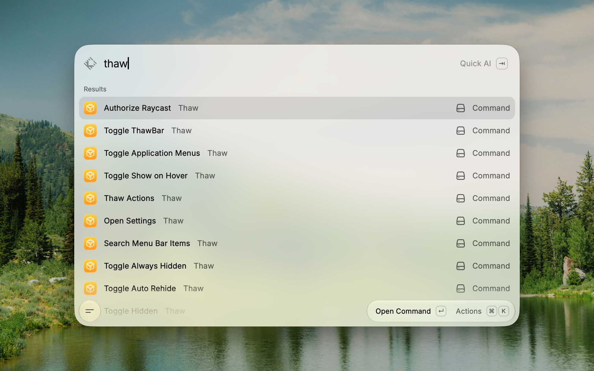

<picture>
  <source media="(prefers-color-scheme: dark)" srcset="./assets/HeaderDarkRaycast.svg">
  <source media="(prefers-color-scheme: light)" srcset="./assets/HeaderLightRaycast.svg">
  
</picture>

 

Control [Thaw](https://github.com/stonerl/Thaw) directly from Raycast. Toggle visibility sections, search menu bar items, and open settings without touching your mouse.

## Requirements

[Thaw](https://github.com/stonerl/Thaw/releases/latest) must be installed and running on your Mac (macOS 26 or later).

## Commands

### Direct actions

These use Thaw's public `thaw://` action URLs and work without enabling Settings URI.

| Command | Description |
|---|---|
| **Thaw Actions** | Browse and run all available Thaw actions from a single searchable list |
| **Toggle Hidden** | Show or hide the hidden menu bar section |
| **Toggle Always Hidden** | Show or hide the always-hidden menu bar section |
| **Search Menu Bar Items** | Open Thaw's built-in menu bar item search panel |
| **Toggle ThawBar** | Toggle the ThawBar on the active display |
| **Toggle Application Menus** | Show or hide application menus |
| **Open Settings** | Open the Thaw settings window |

### Settings URI actions

These require **Settings → Automation → Settings URI Scheme** enabled in Thaw. Run **Authorize Raycast** once so Raycast is whitelisted. Thaw fails these silently if Automation is off — the extension reports that the request was sent, not that the setting changed.

| Command | Description |
|---|---|
| **Authorize Raycast** | Request whitelist access for settings automation |
| **Toggle Auto Rehide** | Turn automatic hidden-section rehide on or off |
| **Toggle Show on Hover** | Turn hidden-section reveal on hover on or off |
| **Toggle Hide Application Menus** | Turn application menu hiding on or off |

## How It Works

The extension communicates with Thaw using its `thaw://` URL scheme. Direct actions work as soon as Thaw is running. Settings toggles need Settings URI enabled and Raycast authorized in Thaw's Automation settings.

From **Thaw Actions**, you can also copy a `thaw://` URL or create a Raycast Quicklink (then assign a hotkey in Raycast Settings → Shortcuts). Prefer Raycast hotkeys on the extension commands themselves rather than duplicating the same keys in Thaw.

## About Thaw

[Thaw](https://github.com/stonerl/Thaw) is a powerful menu bar management tool for macOS 26 and macOS 27. Its primary function is hiding and showing menu bar items, with additional features for arrangement, appearance, hotkeys, and the Thaw Bar — aiming to be one of the most versatile menu bar tools available.
